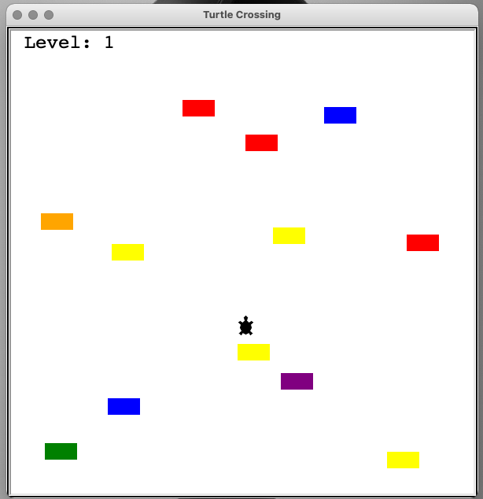
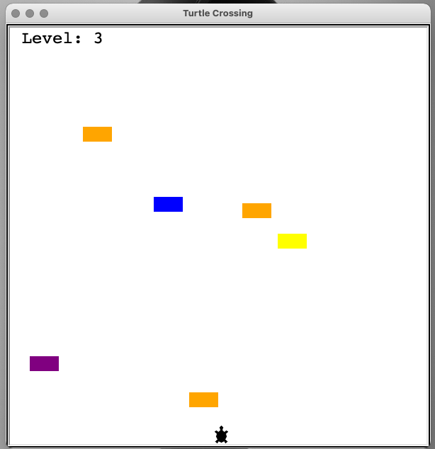
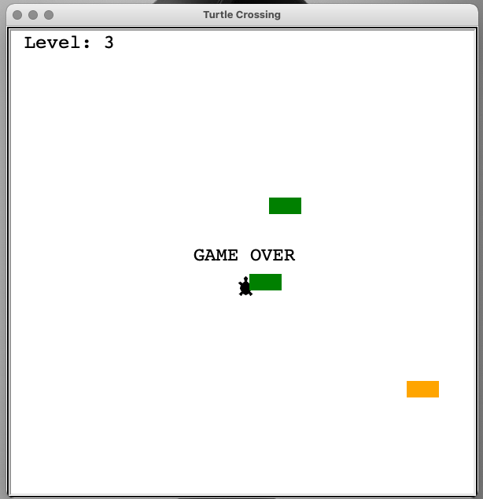

# Turtle Crossing
Turtle Crossing is written in Python and uses the Turtle module to recreate the classic 'Frogger' game.

## Controls
The game uses the 'Up' arrow key on the keyboard to move a turtle from the bottom of the game window to the top.

## Gameplay
The game randomly generates 'cars' on the right edge of the window. The object of the game is to maneuver the turtle from the bottom of the screen to the top. Each successful attempt, will reset the turtle to the bottom of the screen, and advance to the next level, which will increase the difficulty by causing the cars to move faster.

## Screenshot

## Roadmap
- Further design the background, creating 'lanes' by adding horizontal dashed lines
- Darken the background to more closely resemble a street
- Add sound effects
- Add the ability to retain a high score